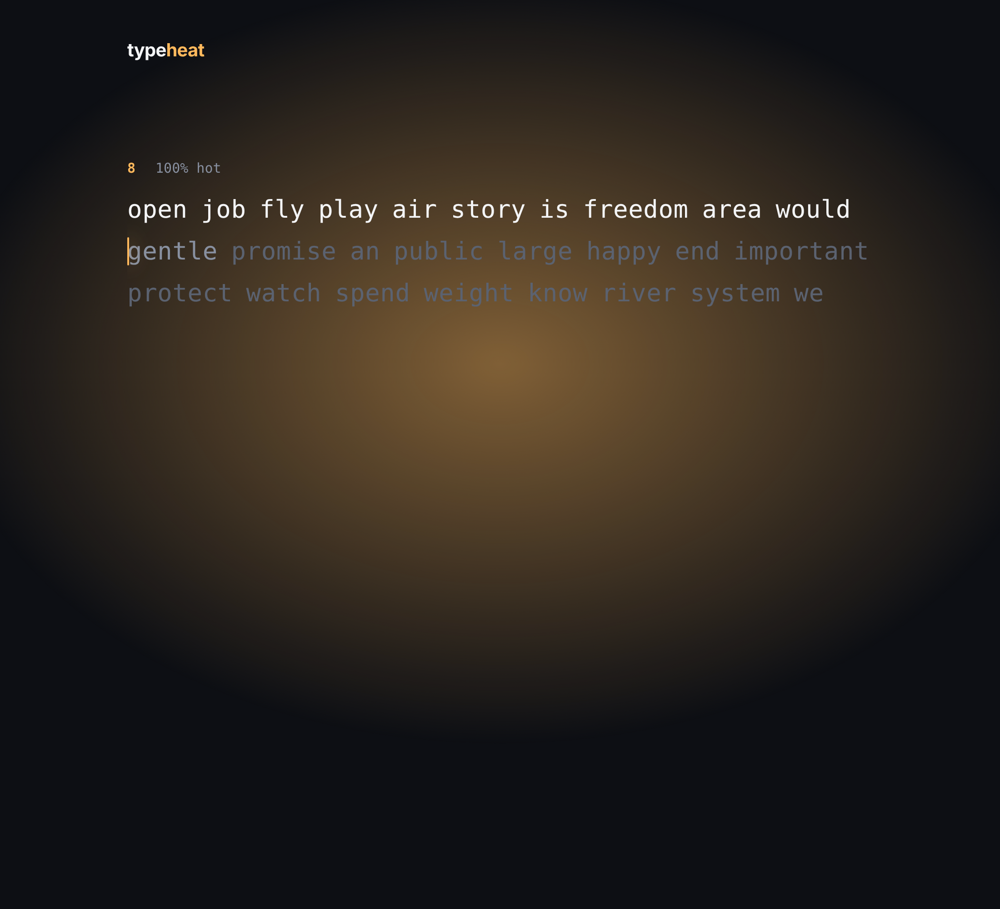
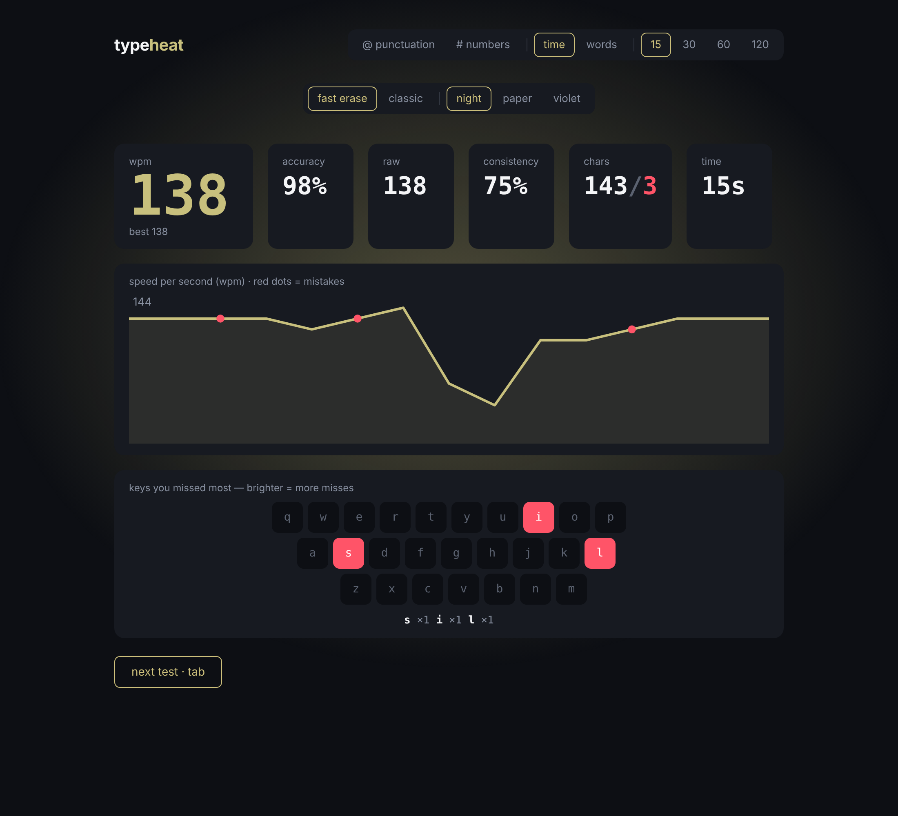

<div align="center">

# typeheat

**A minimal typing test where your speed heats up the screen.**

[**Live demo**](https://YOUR-USERNAME.github.io/typeheat/) · [Features](#features) · [Getting started](#getting-started) · [How it works](#how-it-works) · [Roadmap](#roadmap)




</div>

---

## Why typeheat?

Most typing tests make you hold Ctrl and Backspace together just to delete one bad word, and they only tell you your WPM at the end. typeheat is built around two ideas:

1. **One key to erase a word.** Plain `Backspace` can delete the whole word you are on. No second key, no losing rhythm.
2. **Feedback you can feel while typing.** The glow behind the text and the caret shift from cool teal to amber as your speed climbs, then fade when you slow down. You see your pace without looking at a number.

It stays quiet otherwise: no ads, no accounts, no popups. Settings fade out the moment you start typing.

## Features

| | |
|---|---|
| **Modes** | Time (15 / 30 / 60 / 120 s) and words (10 / 25 / 50 / 100) |
| **Text options** | Punctuation and numbers toggles on a 500-word English list |
| **Backspace** | *Fast erase* (Backspace deletes a word) or *classic* (Backspace deletes a letter, `Ctrl/Alt+Backspace` deletes a word) |
| **Heat effect** | Glow, caret and live "% hot" readout driven by your last ~2 seconds of typing |
| **Endless text** | In time mode, words keep scrolling in, so you never run out before the timer does |
| **Results** | WPM, raw WPM, accuracy, consistency, correct/wrong characters, speed-per-second chart |
| **Missed-key heatmap** | A keyboard that lights up the keys you get wrong most |
| **Personal bests** | Saved per mode and setting in your browser |
| **Themes** | night, paper, violet |
| **Accessibility** | Caret and button transitions turn off under `prefers-reduced-motion`; keyboard-only by design |

<div align="center">

</div>

## Keyboard shortcuts

| Key | Action |
|---|---|
| `Tab` or `Esc` | Restart with a fresh set of words |
| `Backspace` | Delete a word (fast erase) or a letter (classic) |
| `Ctrl` / `Alt` + `Backspace` | Delete a word in classic mode |
| `Space` | Commit the current word and move on |

## Getting started

**Requirements:** Node.js 18 or newer.

```bash
git clone https://github.com/YOUR-USERNAME/typeheat.git
cd typeheat
npm install
npm run dev
```

Open the URL Vite prints (usually http://localhost:5173) and start typing.

| Script | What it does |
|---|---|
| `npm run dev` | Start the dev server with hot reload |
| `npm run build` | Create a production build in `dist/` |
| `npm run preview` | Serve the production build locally |

## How it works

**Scoring**

- **WPM** = correct characters ÷ 5 ÷ minutes. A word only counts when it is typed correctly, spaces included.
- **Raw WPM** = every typed character ÷ 5 ÷ minutes, mistakes included.
- **Accuracy** = correct keystrokes ÷ total keystrokes. A mistake you later fix still counts against you.
- **Consistency** = 100 minus the coefficient of variation of your per-second speed. A steady pace scores higher.

**Heat**

Each keystroke is logged with a timestamp. The heat target is your correct-keystroke rate over the last 2.2 seconds, scaled so 110 WPM is 100%. Every animation frame the displayed value eases toward that target, and it decays on its own if you pause for more than about 600 ms.

**Performance decisions**

- The heat animation runs in a single `requestAnimationFrame` loop that writes straight to the DOM (CSS variables and inline styles). It never touches React state, so it causes no re-renders at 60 fps.
- Typed text and the current word index live in one state object, updated atomically on each keystroke. Keeping them separate caused a crash when keys arrived faster than React could sync them.
- Each word is a memoized component, so a keystroke re-renders only the word you are typing, and new words are generated 60 at a time when fewer than 40 remain.
- The caret position is read from layout offsets, not from bounding rectangles mid-transition, so it never lags behind the text.

## Project structure

```
typeheat/
├── .github/workflows/deploy.yml   # build + publish to GitHub Pages on push to main
├── docs/                          # README screenshots
├── src/
│   ├── App.jsx                    # the whole app: engine, UI, results
│   └── main.jsx                   # React entry point
├── index.html
├── vite.config.js
├── package.json
└── LICENSE
```

The app is a single component today. Splitting the typing engine from the UI is on the roadmap.

## Deployment

The included workflow builds the site and publishes it to GitHub Pages on every push to `main`.

1. Push the repo to GitHub.
2. Go to **Settings → Pages** and set **Source** to **GitHub Actions**.
3. Your site is live at `https://YOUR-USERNAME.github.io/typeheat/` after about a minute.

`vite.config.js` uses `base: "./"`, so the build works under any repository name without changes.

## Roadmap

- [x] Time and words modes, punctuation and numbers
- [x] Fast-erase backspace
- [x] Heat effect
- [x] Results with chart and missed-key heatmap
- [x] Themes and personal bests
- [ ] Mobile and touch support (needs a hidden input field)
- [ ] Remember theme and mode between visits
- [ ] Practice mode that drills your weakest keys and letter pairs
- [ ] Quote mode and code-typing mode
- [ ] Larger, frequency-ranked word lists
- [ ] Sound and caret style options
- [ ] Unit tests for the scoring logic
- [ ] Accounts, history and leaderboards (needs a backend)
- [ ] Multiplayer races

## Known limitations

- Desktop keyboards only for now.
- Personal bests are stored in your browser's `localStorage`, so they are per device and cleared with site data.
- Fonts (Manrope and JetBrains Mono) load from Google Fonts. Offline, the app falls back to system fonts.

## Contributing

Issues and pull requests are welcome. For anything bigger than a small fix, please open an issue first so we can agree on the approach.

```bash
git checkout -b my-change
npm run build   # make sure it still builds
```

## License

[MIT](LICENSE)
